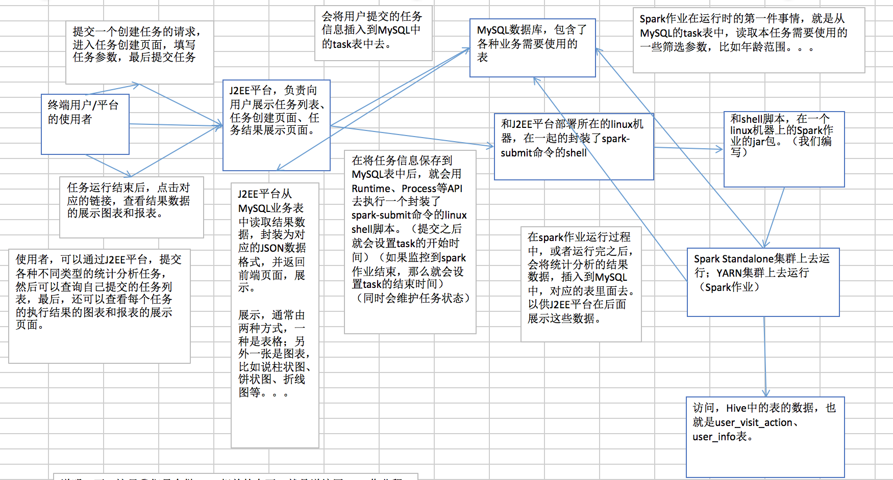

# 电商用户行为分析大数据平台

## 项目介绍

1.基于Spark开发的平台

2.需要有spark基础

3.有很多高级知识和设计模式

4.电商用户行为分析大数据平台（项目名称）

5.访问行为，购物行为，广告点击行为，对这些行为进行分析，使用大数据技术来帮助公司提升业绩。

6.主要的功能模块有用户session分析，页面单跳转化率统计，热门商品离线统计，广告流量实时统计等4个业务模块。

7.所使用的知识点是spark core，spark SQL，spark streaming等三个技术框架。

8.主要是数据倾斜，线上故障，性能调优，troubleshooting等经验。

9.希望达到的效果。

10.需求分析，方案设计，数据设计，编码实现，测试以及性能调优等环节。

## 模块简介

1、用户访问session分析：该模块主要是对用户访问session进行统计分析，包括session的聚合指标计算、按时间比例随机抽取session、获取每天点击、下单和购买排名前10的品类、并获取top10品类的点击量排名前10的session。该模块可以让产品经理、数据分析师以及企业管理层形象地看到各种条件下的具体用户行为以及统计指标，从而对公司的产品设计以及业务发展战略做出调整。主要使用Spark Core实现。

2、页面单跳转化率统计：该模块主要是计算关键页面之间的单步跳转转化率，涉及到页面切片算法以及页面流匹配算法。该模块可以让产品经理、数据分析师以及企业管理层看到各个关键页面之间的转化率，从而对网页布局，进行更好的优化设计。主要使用Spark Core实现。

3、热门商品离线统计：该模块主要实现每天统计出各个区域的top3热门商品。然后使用Oozie进行离线统计任务的定时调度；使用Zeppeline进行数据可视化的报表展示。该模块可以让企业管理层看到公司售卖的商品的整体情况，从而对公司的商品相关的战略进行调整。主要使用Spark SQL实现。

4、广告流量实时统计：该模块负责实时统计公司的广告流量，包括广告展现流量和广告点击流量。实现动态黑名单机制，以及黑名单过滤；实现滑动窗口内的各城市的广告展现流量和广告点击流量的统计；实现每个区域每个广告的点击流量实时统计；实现每个区域top3点击量的广告的统计。主要使用Spark Streaming实现。

## 用户访问Session分析模块

用户session功能介绍

1.对用户访问session进行分析，可以根据使用者指定的某些条件筛选出指定的一些用户，对用户在指定日期范围内发起session，进行聚合统计，比如统计出访问时长在某段时间的session占总session数量的比例，按时间比例。

2.JDBC辅助类封装

3.获取点击量，下单量和支付量都排名10的商品种类

4.获取top10的商品种类的点击数量排名前10的session

5.开发完毕了以上功能以后，需要进行大量，复杂，高端，全套的性能调优。

6.10亿数据量的troubleshooting的经验总结

7.数据倾斜的完美解决方案，数据倾斜往往是大数据处理程序的性能杀手。

8.把使用moc的数据，对模块进行处理，调试。

## 实际架构

1.javaee平台接受到执行统计分析任务的请求之后，会调用封装了spark-submit的shell脚本执行。

2.spark作业获取指定参数，然后运行复杂的作业逻辑，进行该模块的统计和分析。

3.spark作业统计和分析的结果，会写入mySQL中，指定的表。

4.最后通过Javaee进行结果展示。

## 用户访问session介绍

1.用户在电商网站上，通常会有很多点击行为，首页通常都是进入首页，然后可能点击首页上的一些商品，点击首页上的一些品类，也可能随时在搜索框里面搜索关键词，还可能将一些商品加入购物车，对购物车中的多个商品下订单，最后对订单中的多个商品进行支付。

2.用户的每一次操作，可以理解为一个action，比如支付。

3.用户session，指的是用户第一次进入首页，session就开始了。然后在一定时间范围内，直到最后结束，离开网站，关闭浏览器，或者长时间没有操作，那么session就结束了，

4.以上用户在网站内的访问过程，就称为一次session。简单的说，session就是某一天时间内，某个用户对网站从打开或者进入，到做了大量操作，关闭浏览器的过程。就叫做session。

## 数据结构的介绍
### user_visit_action表

&nbsp;&nbsp;&nbsp;&nbsp;&nbsp;&nbsp;其实就是放，比如说网站，或者是app，每天的点击流的数据。可以理解为，用户对网站/app每点击一下，就会代表在这个表里面的一条数据。 

表名：user_visit_action（Hive表）

date：日期，代表这个用户点击行为是在哪一天发生的

user_id：代表这个点击行为是哪一个用户执行的

session_id ：唯一标识了某个用户的一个访问session

page_id:点击了某些商品/品类，也可能是搜索了某个关键词，然后进入了某个页面，页面的id

action_time:这个点击行为发生的时间点

search_keyword:如果用户执行的是一个搜索行为，比如说在网站/app中，搜索了某个关键词，然后会跳转到商品列表页面；搜索的关键词

click_category_id:可能是在网站首页，点击了某个品类（美食、电子设备、电脑）

click_product_id:可能是在网站首页，或者是在商品列表页，点击了某个商品（比如呷哺呷哺火锅XX路店3人套餐、iphone 6s）

order_category_ids:代表了可能将某些商品加入了购物车，然后一次性对购物车中的商品下了一个订单，这就代表了某次下单的行为中，有哪些商品品类，可能有6个商品，但是就对应了2个品类，比如有3根火腿肠（食品品类），3个电池（日用品品类）

order_product_ids:某次下单，具体对哪些商品下的订单

pay_category_ids:代表的是，对某个订单，或者某几个订单，进行了一次支付的行为，对应了哪些品类

pay_product_id:代表的，支付行为下，对应的哪些具体的商品

### user_info表

&nbsp;&nbsp;&nbsp;&nbsp;&nbsp;&nbsp;&nbsp;实际上，就是一张最普通的用户基础信息表；这张表里面，其实就是放置了网站/app所有的注册用户的信息。那么我们这里也是对用户信息表，进行了一定程度的简化。比如略去了手机号等这种数据。因为我们这个项目里不需要使用到某些数据。那么我们就保留一些最重要的数据，即可。 

表名：user_info（Hive表）

user_id：其实就是每一个用户的唯一标识，通常是自增长的Long类型，BigInt类型

username：是每个用户的登录名

name：每个用户自己的昵称、或者是真实姓名

age：用户的年龄

professional：用户的职业

city：用户所在的城市

### task表

&nbsp;&nbsp;&nbsp;&nbsp;&nbsp;&nbsp;其实是用来保存平台的使用者，通过J2EE系统，提交的基于特定筛选参数的分析任务，的信息，就会通过J2EE系统保存到task表中来。之所以使用MySQL表，是因为J2EE系统是要实现快速的实时插入和查询的。 

表名：task（MySQL表）

task_id：表的主键

task_name：任务名称

create_time：创建时间

start_time：开始运行的时间

finish_time：结束运行的时间

task_type：任务类型，就是说，在一套大数据平台中，肯定会有各种不同类型的统计分析任务，比如说用户访问session分析任务，页面单跳转化率统计任务；所以这个字段就标识了每个任务的类型

task_status：任务状态，任务对应的就是一次Spark作业的运行，这里就标识了，Spark作业是新建，还没运行，还是正在运行，还是已经运行完毕

task_param：最最重要，用来使用JSON的格式，来封装用户提交的任务对应的特殊的筛选参数.

### 总体任务的流程

## 用户访问Session分析需求分析
## 需求分析

&nbsp;&nbsp;&nbsp;&nbsp;&nbsp;&nbsp;&nbsp;在互联网企业中，需求分析，首先就是要和产品经理也就是负责设计你开发的大数据平台产品的人，去大量开会，去沟通需求的细节。

1.按条件筛选session

&nbsp;&nbsp;&nbsp;&nbsp;&nbsp;&nbsp;&nbsp;搜索过某些关键词的用户，访问时间在某个时间段的用户，年纪在某个范围的用户，职业在某个范围内的用户，所在某个城市的用户，发起的session。找到对应用户的session，也就是我们所说的第一步，按照条件筛选session。

最大的作用就是灵活。也就是说可以让使用者，对感兴趣的和关心的用户群体，进行后续各个复杂业务逻辑的统计和分析，那么拿到结果数据就是只是针对特殊用户群体的分析结果。

2.统计出符合条件的session中，访问时长在1-2s，4-6s等各个范围内的session占比等。

&nbsp;&nbsp;&nbsp;&nbsp;&nbsp;&nbsp;&nbsp;session访问时长，也就是说一个session对应的开始的action，到结束的session，之间的时间范围。还有，就是访问步长，指的是，一个session执行期间内，依次点击多少个页面。

可以让人从全局的角度看到，符合某些条件的用户群体，使用产品的习惯，对于使用者来说，有一个全局和清晰的认识。

3.在符合添加的session中，按照时间比例随机抽取1000个session。

&nbsp;&nbsp;&nbsp;&nbsp;&nbsp;&nbsp;&nbsp;这个功能的作用是可以让使用者，能够对符合条件的session，按照时间比例均匀的随机采取1000个session，然后观察每个session具体的点击流行为，比如先进入首页，然后点击食品品类，然后点具体商品，然后下单支付。

之所以使用随机采样，就是观察样本的公平性。

4.在符合条件的session中，获取点击，下单和支付数量前10的品类。

&nbsp;&nbsp;&nbsp;&nbsp;&nbsp;&nbsp;&nbsp;计算出所有这些session对各个品类的点击，下单和支付的次数，然后按照这三个属性进行排序，获取前10品类。

这个功能很重要，可以让我们明白就是符合条件的用户，他最感兴趣的商品是什么总类，这个可以让公司里的人，清晰地了解不同的层次，不同的用户的心理和喜好。

5.对排名前10的品类，分别获取其点击次数排名前10的session

&nbsp;&nbsp;&nbsp;&nbsp;&nbsp;&nbsp;&nbsp;这个功能可以让我们了解对某个用户群体最感兴趣的品类，各个品类最感兴趣最典型的用户的session的行为

用户访问session分析技术方案

这个过程涉及到技术的选型，前端是JavaEE+Spark+MySQL。实现需求，你的技术实现思路，以及在思路中，可能使用到的技术要点。

1.按条件筛选
&nbsp;&nbsp;&nbsp;&nbsp;&nbsp;&nbsp;&nbsp;&nbsp;&nbsp;&nbsp;按条件筛选session，但是这个筛选的粒度是不同的，比如说搜索词，访问时间，那么这个都是session粒度，甚至是action粒度，那么还有，就是针对用户的基础信息进行筛选，年龄，性别，职业，所以说筛选粒度是不统一的。

每天的用户访问数据量是很大的，针对于筛选粒度不统一的问题，以及数据量巨大，可能会有两个问题，首先第一个，就是如果不统一筛选粒度，那么就必须得对所有的数据进行全量的扫描，第二个就是扫描的话，量实在是太大了。

为了解决以上问题，我们这里对原始的数据进行聚合，什么粒度聚合呢？session粒度的聚合。也就是说，用一些最基本的筛选条件，比如时间范围，从hive表中提取数据，

然后呢，按照session ID这个字段进行聚合统计那么聚合后的一天记录，就是一个用户的某个session在指定时间内的访问记录，比如搜过所有的关键词，点击过的所有品类ID点击session对应的userID关联的用户的基础信息。

聚合过后，针对session粒度的数据，按照使用者指定的筛选条件，进行数据的筛选。筛选出来符合条件的用户session粒度数据，其实就是我们想要的那些session。

2.聚合统计

&nbsp;&nbsp;&nbsp;&nbsp;&nbsp;&nbsp;&nbsp;&nbsp;&nbsp;对于某个时间段的session的数量，就需要累加，基本上实现这个最好的选择就是accumulator变量，但是问题又来了如果使用基础的accumulator变量，导致维护变得更加复杂，在修改代码的时候，很可能会导致错误。

我们可以使用自定义的accumulator的技术，实现复杂的分布式计算。

3.在符合条件的session中，按照时间比例随机抽取1000个session

&nbsp;&nbsp;&nbsp;&nbsp;&nbsp;&nbsp;&nbsp;&nbsp;&nbsp;使用groupbykey等算子进行计算

4.在符合条件的session中，获取点击下单和支付数量排名前10的品类

&nbsp;&nbsp;&nbsp;&nbsp;&nbsp;&nbsp;&nbsp;&nbsp;&nbsp;需要对每个品类的点击，下单和支付数量都进行计算。使用spark的自定义key进行二次排序技术，来实现所有的品类，按照三个字段，点击数量，下单数量，支付数量依次进行排序，首先比较点击数量，如果相同的话，那么比较下单数量，如果还是相同，那么比较支付数量。

5.对排名前10的品类，分别获取点击次数前10的session  

&nbsp;&nbsp;&nbsp;&nbsp;&nbsp;&nbsp;&nbsp;&nbsp;&nbsp;这个需求，需要使用spark的分组获取topN的算法进行实现。也就是对排名前10的品类对应的数据，按照品类ID进行分组，然后求出每组点击数量排名前10的session。

### 总结

总结一下，可以学习到的知识点

1.通过底层数据聚合，来减少spark作业处理数据，从而提升spark作业的性能，从根本上提升spark性能的技巧。

2.自定义accumulator实现复杂分布式计算的技术

3.spark按时间比例随机抽取算法

4.spark自定义key二次排序技术

5.spark分组取topN算法

6.通过spark的各个功能和技术点，进行各种聚合，采样，排序，取topN业务的实现。

## 用户访问session数据表分析

&nbsp;&nbsp;&nbsp;&nbsp;&nbsp;&nbsp;&nbsp;在进行完了数据调研、需求分析、技术实现方案，进行数据设计。数据设计，往往包含两个环节，第一个呢，就是说，我们的上游数据，就是数据调研环节看到的项目基于的基础数据，是否要针对其开发一些Hive ETL，对数据进行进一步的处理和转换，从而让我们能够更加方便的和快速的去计算和执行spark作业；第二个，就是要设计spark作业要保存结果数据的业务表的结构，从而让J2EE平台可以使用业务表中的数据，来为使用者展示任务执行结果。 

第一表：session_aggr_stat表，存储第一个功能，session聚合统计的结果

    CREATE TABLE `session_aggr_stat` (
      `task_id` int(11) NOT NULL,
      `session_count` int(11) DEFAULT NULL,
      `1s_3s` double DEFAULT NULL,
      `4s_6s` double DEFAULT NULL,
      `7s_9s` double DEFAULT NULL,
      `10s_30s` double DEFAULT NULL,
      `30s_60s` double DEFAULT NULL,
      `1m_3m` double DEFAULT NULL,
      `3m_10m` double DEFAULT NULL,
      `10m_30m` double DEFAULT NULL,
      `30m` double DEFAULT NULL,
      `1_3` double DEFAULT NULL,
      `4_6` double DEFAULT NULL,
      `7_9` double DEFAULT NULL,
      `10_30` double DEFAULT NULL,
      `30_60` double DEFAULT NULL,
      `60` double DEFAULT NULL,
      PRIMARY KEY (`task_id`)
    ) ENGINE=InnoDB DEFAULT CHARSET=utf8
    

第二个表：session_random_extract表，存储我们的按时间比例随机抽取功能抽取出来的1000个session

    CREATE TABLE `session_random_extract` (
      `task_id` int(11) NOT NULL,
      `session_id` varchar(255) DEFAULT NULL,
      `start_time` varchar(50) DEFAULT NULL,
      `end_time` varchar(50) DEFAULT NULL,
      `search_keywords` varchar(255) DEFAULT NULL,
      PRIMARY KEY (`task_id`)
    ) ENGINE=InnoDB DEFAULT CHARSET=utf8
    

第三个表：top10_category表，存储按点击、下单和支付排序出来的top10品类数据

    CREATE TABLE `top10_category` (
      `task_id` int(11) NOT NULL,
      `category_id` int(11) DEFAULT NULL,
      `click_count` int(11) DEFAULT NULL,
      `order_count` int(11) DEFAULT NULL,
      `pay_count` int(11) DEFAULT NULL,
      PRIMARY KEY (`task_id`)
    ) ENGINE=InnoDB DEFAULT CHARSET=utf8;
    

第四个表：top10_category_session表，存储top10每个品类的点击top10的session

    CREATE TABLE `top10_category_session` (
      `task_id` int(11) NOT NULL,
      `category_id` int(11) DEFAULT NULL,
      `session_id` varchar(255) DEFAULT NULL,
      `click_count` int(11) DEFAULT NULL,
       PRIMARY KEY (`task_id`)
    ) ENGINE=InnoDB DEFAULT CHARSET=utf8;
    

最后一张表：session_detail，用来存储随机抽取出来的session的明细数据、top10品类的session的明细数据

    CREATE TABLE `session_detail` (
      `task_id` int(11) NOT NULL,
      `user_id` int(11) DEFAULT NULL,
      `session_id` varchar(255) DEFAULT NULL,
      `page_id` int(11) DEFAULT NULL,
      `action_time` varchar(255) DEFAULT NULL,
      `search_keyword` varchar(255) DEFAULT NULL,
      `click_category_id` int(11) DEFAULT NULL,
      `click_product_id` int(11) DEFAULT NULL,
      `order_category_ids` varchar(255) DEFAULT NULL,
      `order_product_ids` varchar(255) DEFAULT NULL,
      `pay_category_ids` varchar(255) DEFAULT NULL,
      `pay_product_ids` varchar(255) DEFAULT NULL,
      PRIMARY KEY (`task_id`)
    ) ENGINE=InnoDB DEFAULT CHARSET=utf8;
    

额外的一张表：task表，用来存储J2EE平台插入其中的任务的信息

    CREATE TABLE `task` (
      `task_id` int(11) NOT NULL AUTO_INCREMENT,
      `task_name` varchar(255) DEFAULT NULL,
      `create_time` varchar(255) DEFAULT NULL,
      `start_time` varchar(255) DEFAULT NULL,
      `finish_time` varchar(255) DEFAULT NULL,
      `task_type` varchar(255) DEFAULT NULL,
      `task_status` varchar(255) DEFAULT NULL,
      `task_param` text,
      PRIMARY KEY (`task_id`)
    ) ENGINE=InnoDB AUTO_INCREMENT=1 DEFAULT CHARSET=utf8;
    

完成了数据调研、需求分析、技术方案设计、数据设计以后，正式进入编码实现和功能测试阶段。最后才是性能调优阶段。 
## 编码以及实现思路
### 数据筛选与聚合
&nbsp;&nbsp;&nbsp;&nbsp;&nbsp;&nbsp;&nbsp;通过执行任务的参数时间(筛选范围的开始时间和结束时间)筛选出符合要求的数据。
聚合实现的思路是:根据时间筛选后的actionClick的数据，映射成为Pair<SessionId,Row>的形式，Row表示每一次点击行为。
然后根据SessionId进行分组，对于分组后的数据根据SessionId粒度进行聚合，封装有价值的数据(搜索词，点击品类等)
在SessionId粒度聚合后，查询出所有的用户，将用户映射成为Pair<Long,Row>，对于上诉两个RDD进行Join，将点击信息和用户信息封装成String的数据格式，
按照SessionId为Key，需求信息为Value返回。
&nbsp;&nbsp;&nbsp;&nbsp;&nbsp;&nbsp;&nbsp;在进行聚合后，根据执行任务的相关参数进行进一步的筛选操作，比如在根据用户性别，职业，城市，
搜索词，点击的品类id进行筛选。
### 统计各个范围内的Session和步长占比
&nbsp;&nbsp;&nbsp;&nbsp;&nbsp;&nbsp;&nbsp;实现自定义Accumulator,在自定义Accumulator中实现各个范围内的操作，这里是一个统一的操作。
在上面的根据需求进行筛选的时候，我们可以利用上述的过程进行代码重构，计算每一个Session的访问时长，在判断完符合条件后，可以利用自定义的Accumulator
进行各个范围的SessionId，还有就是各个范围的步长；通过得到每个范围的数量后，计算出来占比，然后插入到数据库。
### 随机抽取100个session
&nbsp;&nbsp;&nbsp;&nbsp;&nbsp;&nbsp;&nbsp;利用上面Session粒度的聚合代码，进行代码重构，计算出每一个Session的开始时间和结束时间。
将过滤后的RDD映射成为Pair形式，Key为Date_Hour,Value为需求信息，然后将这个Pair按照日期和时间划分，也就是
Map<String,Map<String,Long>> dateHourCount,日期作为Key，时间和数量作为Map，计算总的Session个数，然后每一天平摊100个，在根据每天的数量
计算每一个小时的个数，然后调用一个随机的函数，获得随机索引，然后再遍历过滤需求，如果找到随机索引对应的信息，那么将信息保存在一个List里面批量插入；
之后，将得到的SessionId按照join过滤后的数据，然后分区进行批量插入(这也是性能优化之一)。
### 获取热门品类Top10
&nbsp;&nbsp;&nbsp;&nbsp;&nbsp;&nbsp;&nbsp;想将按照需求过滤后的数据和按照时间过滤后的数据进行Join操作，得到完整的数据，也就是每一次点击的
行为还有用户的特征，然后获取点击、下单和支付的品类Id，注意这里需要去重，然后分别计算点击、下单和支付品类的各个Id和次数，将上一次得到的品类id和这三步
相LeftOuterJoin最后的得到一个RDD，这个RDD进行map后放入我们自定义的二次排序类，然后将数据后批量插入到数据库。
### 获取每一个热门品类的Top10Session
&nbsp;&nbsp;&nbsp;&nbsp;&nbsp;&nbsp;&nbsp;根据上面获取Top10的品类Id，然后根据以往筛选的数据，计算每一个用户对于品类的点击次数，然后和
Top10的数据相Join然后计算每一个品类的点击次数，在根据CategoryId进行分组，拿到TopN的session数据插入数据库。

## 用户访问Session的比较高端技术
### 自定义Accumulator
&nbsp;&nbsp;&nbsp;&nbsp;&nbsp;&nbsp;&nbsp;&nbsp;&nbsp;使用自定义Accumulator降低维护成本，一个就可以搞定很多业务需求

## 性能调优篇
### 性能调优之在实际项目中分配更多资源
性能调优的王道，增加和分配更多的资源，性能和速度上的调优，是显而易见的，基本上在一定范围内，增加资源与性能的提升，是成正比的，写完一个spark作业以后
，进行性能调优。
1.分配那些资源？
     executor， CPU per executor， memory per executor

2.在哪里分配这些资源？  提交shell脚本的时候

3.怎么调优，以及调优的原则？
   第一种spark standalone，公司集群上，搭建一套spark集群技术心里应该清楚。
   第二种，yarn，资源调度。应该去查看，你的spark作业，要提交到资源队列技术大概有多少资源？
一个原则，你能使用的资源能有多大，就尽量调节到最大。

4.为什么多分配这些资源以后我性能会得到提升？
### 性能调优之Spark并行度
Spark并行度，其实就是指的是spark作业中，各个stage的task数量，也就代表了spark作业的各个阶段的并行度。

如果不调节，并行度，导致并行度过低，会怎么样？
   
   你的资源虽然分配足够了，但是问题是并行度没有与资源想匹配，导致你的资源分配浪费。

合理的并行度的设置，应该是要设置的足够大，大到可以完全合理的利用你的集群资源。

1.task数量，至少设置成与spark application的总CPU core数量相同

2.官方推荐，task数量，设置成为spark application总CPU core数量的2-3倍，

实际情况，与理想情况不同的，有些task会运行快一点，有些task可能会慢一点，如果你的task设置的和CPU core数量相同，可能会导致资源浪费。

3.如何设置一个 spark application的并行度？   spark.default.parallelism参数，在conf中设置。
### 性能调优之RDD重构和持久化
1.默认情况下，多次对一个RDD执行算子，去获取不同的RDD，都会对这个RDD以及以前的父RDD，全部重新计算一次。

对于这种情况，是一定要避免的，一旦出现一个RDD重复计算，就会导致性能急剧降低。

2.RDD架构重构优化
   
  尽量去复用RDD，差不多的RDD，可以抽取成为一个共同的RDD供后面的RDD计算，反复使用。

公共的RDD一定要实现持久化。持久化也就是说，将RDD的数据缓存到内存或者磁盘中，之后无论进行多少次计算，都直接取这个RDD的持久化的数据。
  
  持久化，是可以进行序列化的。如果正常将持久化在内存，那么可能会导致内存的占用过大，这样的话，会知道内存溢出。
  
  当内存无法支持公共RDD数量完全存放的时候，就优先考虑，使用序列化的方式在存内存存储。序列化的方式，唯一的缺点是在获取数据的时候，需要到反序列化。
  
  如果序列化纯内存，只能内存+磁盘的序列化方式。
  
  为了数据的高可靠性，而且内存充足可以使用双副本，进行持久化。持久化的双副本机制，因为机器宕机了，副本就丢了，需要重复机制，但是这样是针对你的资源很充分。
### 性能调优之在实际项目中广播大变量
  
  默认情况下，task执行的算子中，使用外部的变量，每个task都会获取一份变量，有什么缺点？在什么情况下会出现性能上的优劣影响？
  
  每一个task出现一份变量，极其消耗内存，有可能导致堆内存不足，频繁GC，以及RDD持久化部分写入到磁盘，从而导致磁盘IO的消耗等。

如何解决上述性能影响呢？
   
   广播变量。广播变量在driver上会有一份初始的副本，第一个executor都有一个BlockManager负责管理某个内存和磁盘上的数据，

这个会在driver上拉去相应的广播变量，有可能会从远层的driver上获取变量副本，也有可能从距离比较近的其他节点获取。

广播变量的好处，不是每一个task一个变量副本，而是每一个executor一个变量副本，这样减少网络传输数据，也给减少了内存存储。
### 性能优化之在实际项目中使用Kryo序列化
默认情况下，spark内部使用java的序列化机器，objectOutPutStream/objectInPutStream对象输入输出流机制，

通过这种机制序列化，这种默认的序列化机制好处在于不必手动，但是缺点在于效率不高，占用内存比较大，。

Kryo序列化机制，速度快乐序列化之后数据更小，大概是java序列化机制的1/10，在序列化之后，可以让网络传输的数据变小，内存资源也变小。
      
kyro序列化机制:
    1.算子函数中使用的外部变量
    2.持久化RDD进行序列化
    3.shuffle过程
    
### 性能优化之Json数据格式优化
FastUtil是扩展了Java标准集合框架的类库，提供了特定类型的Map,Set,List,Queue，ArrayList,HashMap能够提供更小的内存占用，更快的存取速度，

也提供了64位的Array,Set,List以及快速的和实用的IO类处理二进制和文本文件。最新版本要求Java7以及以上版本。我们使用FasyUtil提供的集合类，

来替代自己平时使用的JDK的原生的Map，List,Set好处在于FastUtil集合类，可以减少内存的占用，并且在集合遍历，根据索性获取元素的值和设置元素的值，

提供更快的存取速度。除了对象和原始类型，fastutil也提供引用类型的支持，但是使用等于号进行比较的，而不是equals（）方法。

Spark应用fastutil

1.如果算子函数使用了外部变量，那么第一，你可以使用Broadcast广播变量优化，第二可以使用kyro序列化类库，提升序列化性能和效率，

第三，如果外部变量是某种比较大的集合，那么可以考虑使用fastutil改写外部变量，首先从源头上减少内存的占比，通过广播变量进一步减少内存占用，

通过kyro序列化类库进一步减少内存占比。

### 性能调优之调节数据本地化等待时间
   spark的task分配算法，优先会希望每个task正好分配到它要计算的数据所在的节点，这样就不用在网络间传输数据。但是，一般是事与愿违，通常spark还会等待一段时间，默认情况下是3秒，如果不行，就会选择这个比较差的本地化级别，比如说将task分配到靠它要计算的数据所在的节点在比较近的一个节点，然后进行计算。
如果发生数据传输，task会通过其所在节点的BlockManager来获取数据，通过一个getRemote方法，通过网络传输组件从数据所在的节点的BlockManager中，获取数据通过网络传输回task所在的节点进行计算。
  
   最佳情况，task和BlockManager直接在一个executor进程内，走内存速度最佳;同一机架，不在一个节点，需要网络传输;在一个节点，多个executor之间数据传输;不同机架，跨机架之间的网络传输，这种情况对性能的影响非常大。

PROCESS_LOCAL:进程本地化，代码和数据在同一进程，也就是同一个executor，计算的task由executor执行，BlockManager中有数据，性能最好。

NODE_LOCAL:节点本地化，代码和数据在同一节点，但是数据在不同进程。

RACK_LOCAL:在一个机架上，需要跨节点拉去数据。

ANY:跨机架拉去数据。

spark.locality.wait默认是3s。

在什么时候调节数据本地化参数呢？

观察spark作业的运行日志，推荐首先使用本地模式，在日志中会显示数据本地化级别大多数是PROCESS_LOCAL，调节。
如果是其他，最好是调节一下数据本地化的等地时长。需要反复调节每次调节完，再运行，观察日志。看看大部分task的本地化级别有没有提提升，看看整个spark作业运行时间有没有缩短。

怎么调节？

spark.locality.wait.process

spark.locality.wait.node

spark.locality.wait.rack

在SparkConf中设置即可

### JVM调优原理之降低cache操作的内存比
有哪些调优?

1.常规性能调优，分配资源，并行度

2.JVM调优，JVM相关的参数，通常情况下，如果你的硬件配置，基础的JVM的配置，通常都不会造成太严重的性能问题。主要是在线上故障中，JVM占很重要的地位。

3.shuffle调优，spark在执行groupbykey,reducebykey等操作时，shuffle环节很重要，shuffle调优，其实对spark作业的性能的影响相当高，基本上shuffle的性能消耗，占用整个spark的50％及以上。

4.spark操作的调优，gourpbykey,countbykey来重构，有些算子性能，是比其他算子的性能要高
         
Spark中，堆内存，又被划分成为两部分，一块是专门用来给RDD的cache,persist进行数据缓存用的，还有一块是用来算子运算的，存放函数中自己创建的对象。   

默认情况下，给算子cache操作的内存占比，是0.6，也就是用于算子做算的只占有0.4。如果出现频道的GC，如果cache操作很充足，那么就可以调节一下占比，降低

cache操作的内存占比，大不了用persist操作，选择将缓存的数据写入磁盘，配合序列化方式，减少算子缓存内存占比。
         
一句话，让task执行算子函数有更多的内存可以是使用。可以使用参数spark.storage.memoryFraction进行调节，默认是0.6。

### JVM调优之调节executor堆外内存之连接等待时长
有时候，如果你的spark作业处理的数据量特别大的几亿数据量，然后作业一运行，时不时的保存，shuffle file cannot find，task lost ，oom。

可以说你的executor的堆外内存不足够，导致executor在运行的过程中，可能会内存溢出，然后导致后续的stage的task在运行的时候，可能要从一些

executor中拉去shuffle map output文件，但是executor可能会挂掉，关联的block manager也没有了，可能会报shuffle output not found 

等spark作业会彻底崩溃。

上述情况，可以考虑调节executor的堆外内存占比此外，有时堆外内存调节的比较的时候，对于性能的提升会有一定的提升。

如何调节？

在spark-submit的脚本中，去用--conf的方式，去添加配置。

spark.yarn.executor.memoryOverhead参数，针对的的是yarn的提交方式。

通过这个参数调节以后，可以避免以上问题的避免。

对于等待时间，就是在出现上述错误的时候，连接不上拉去数据的Block Manager，就会出现这个问题，我们需要在spark-submit脚本中配置等待时长，默认是60秒。
## troubleshooting
### troubleshooting之控制shuffle reduce端缓冲大小避免OOM
shuffle过程中优map端的task是不断的输出数据的，数据量可能是很大的，但是，其实reduce端的task，并不是等到map端task将属于自己的那份数据全部

写入磁盘文件之后，再拉去的，map端写一点数据，reduce端task就会拉去一部分数据，立即进行后面的聚合，算子函数的应用。

每次reduce能够拉去多少数据，就是由buffer来决定的，因为拉去过来的数据，都是先放在buffer中的，然后才用后面的executor分配的堆内存占比，

hashmap去进行后续的聚合，函数执行。

reduce端缓冲，可能出现什么问题？

默认48MB，reduce端task一边拉取一边计算，不一定一直会拉满48MB的数据，可能大多数情况下，拉取10MB就计算掉了。

大多数时候，也不会出现问题，有些时候map端的数据量特别大，然后写出的数据特别快，reduce端所有的task拉去的时候全部到达自己极限值。

这个时候加上你的reduce端执行的聚合函数的代码，就可能创建大量的对象，一下子，内存就出现OOM。reduce端的内存中，就出现了内存溢出。

怎么解决呢？

减少reduce端task缓冲大小，这样就不容易出现OOM问题了。

spark作业，首先，第一要义，就是一定要让它跑起来，然后再考虑性能。

关于reduce端缓冲大小的另外一面，关于性能调优:

如果资源特别充分，可以尝试增加reduce端缓冲大小，这样就可以减少拉取次数，减少网络传输。

配置的参数，spark.reducer.maxSizeInflight
